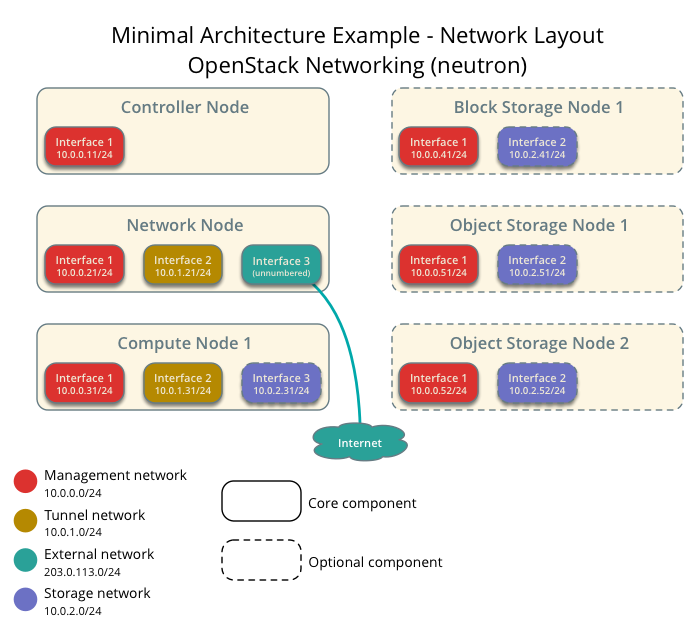
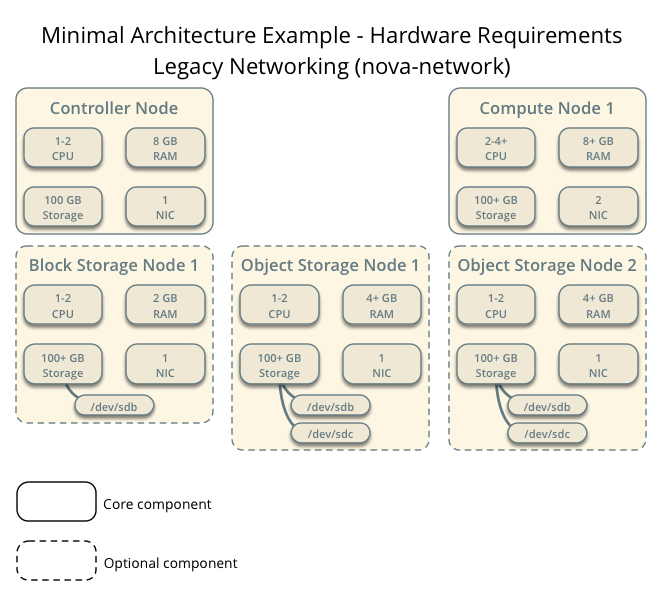
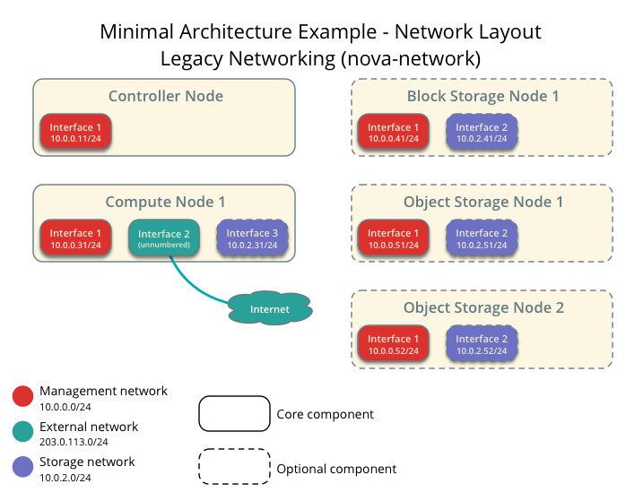

# CentOS Neutron 安裝
我們已經完成了單一節點的安裝，但是要將功能拆分成多台該如何實現呢？這次我們安裝包含了```neutron``` 的三個節點架構以及選擇性的```區塊儲存```和```物件儲存```服務節點：
* **Controller Node** : 會運作```KeyStone```、```Glance```、管理運算的部分和網路服務，並運作```網路plugin```以及```Horizon儀表板```。還包括一些支援的服務，例如```SQL資料庫```、```訊息佇列(message queue)```和```網路時間協定(NTP)```。
* **Network Node** : 運作Networking plugin和一些租戶(Tenant)網路提供的代理，並提供```switching```、```routing```、```NAT```和```DHCP```服務。這個節點也處理租戶虛擬機實例的```外部網路(Internet)```連接。
* **Compute node** : 運作Compute的```hypervisor```部分，這個部分將操作tenant virtual machines或實例。預設情況下，Compute使用```KVM```作為hypervisor。運算節點也可以運行Networking plugin和代理，它們連接租戶網路到虛擬機上，並提供防火牆( security groups )服務。

 > 可以運作不止一台運算節點。

* **Block Storage Node** :  區塊儲存節點包含磁碟，區塊儲存服務會向租戶虛擬機實例提供這些磁碟。

 > 可以運作多個區塊儲存節點，來擴展Volume。

* **Object Storage Node** : 物件儲存節點包含磁碟，物件儲存服務使用這些磁碟來儲存```帳戶```、```容器```和```物件```。

 > 可以運行多個物件儲存節點。但是在最小架構範例中，需要兩個節點。

## 最小架構環境
下圖包含OpenStack 網路(neutron) 的最小架構範例的硬體需求：


下圖包含OpenStack 網路(neutron) 的網路層的最小架構範例圖：


下圖包含OpenStack 網路(neutron) 服務層的最小架構範例：


# CentOS Nova Network 安裝
我們已經完成了單一節點的安裝，但是要將功能拆分成多台該如何實現呢？這次我們安裝包含了```nova-network``` 的兩個節點架構以及選擇性的```區塊儲存```和```物件儲存```服務節點：
* **Controller Node** : 會運作```KeyStone```、```Glance```、管理運算的部分，並運作```Horizon儀表板```。還包括一些支援的服務，例如```SQL資料庫```、```訊息佇列(message queue)```和```網路時間協定(NTP)```。
租戶虛擬機實例的```外部網路(Internet)```連接。
* **Compute node** : 運作Compute的```hypervisor```部分，這個部分將操作tenant virtual machines或實例。預設情況下，Compute使用```KVM```作為hypervisor。Compute也提供連接租戶網路到虛擬機上，並提供防火牆( security groups )服務。

 > 可以運作不止一台運算節點。

* **Block Storage Node** :  區塊儲存節點包含磁碟，區塊儲存服務會向租戶虛擬機實例提供這些磁碟。

 > 可以運作多個區塊儲存節點，來擴展Volume。

* **Object Storage Node** : 物件儲存節點包含磁碟，物件儲存服務使用這些磁碟來儲存```帳戶```、```容器```和```物件```。

 > 可以運行多個物件儲存節點。但是在最小架構範例中，需要兩個節點。

## 最小架構環境需求
下圖包含OpenStack 傳統網路(nova-network) 的最小架構範例的硬體需求：


下圖包含OpenStack 傳統網路(nova-network) 的網路層的最小架構範例圖：


下圖包含OpenStack 傳統網路(nova-network) 服務層的最小架構範例：


## 安全設定
| 密碼名稱 | 說明 |
| -- | -- |
| Database password (no variable used) | Root password for the database |
| ADMIN_PASS | Password of user admin |
| CEILOMETER_DBPASS | Database password for the Telemetry service |
| CEILOMETER_PASS | Password of Telemetry service user ceilometer |
| CINDER_DBPASS | Database password for the Block Storage service |
| CINDER_PASS | Password of Block Storage service user cinder |
| DASH_DBPASS | Database password for the dashboard |
| DEMO_PASS | Password of user demo |
| GLANCE_DBPASS | Database password for Image service |
| GLANCE_PASS | Password of Image service user glance |
| HEAT_DBPASS | Database password for the Orchestration service |
| HEAT_DOMAIN_PASS | Password of Orchestration domain |
| HEAT_PASS | Password of Orchestration service user heat |
| KEYSTONE_DBPASS | Database password of Identity service |
| NEUTRON_DBPASS | Database password for the Networking service |
| NEUTRON_PASS | Password of Networking service user neutron |
| NOVA_DBPASS | Database password for Compute service |
| NOVA_PASS | Password of Compute service user nova |
| RABBIT_PASS | Password of user guest of RabbitMQ |
| SAHARA_DBPASS | Database password of Data processing service |
| SWIFT_PASS | Password of Object Storage service user swift |
| TROVE_DBPASS | Database password of Database service |
| TROVE_PASS | Password of Database service user trove |


# 


