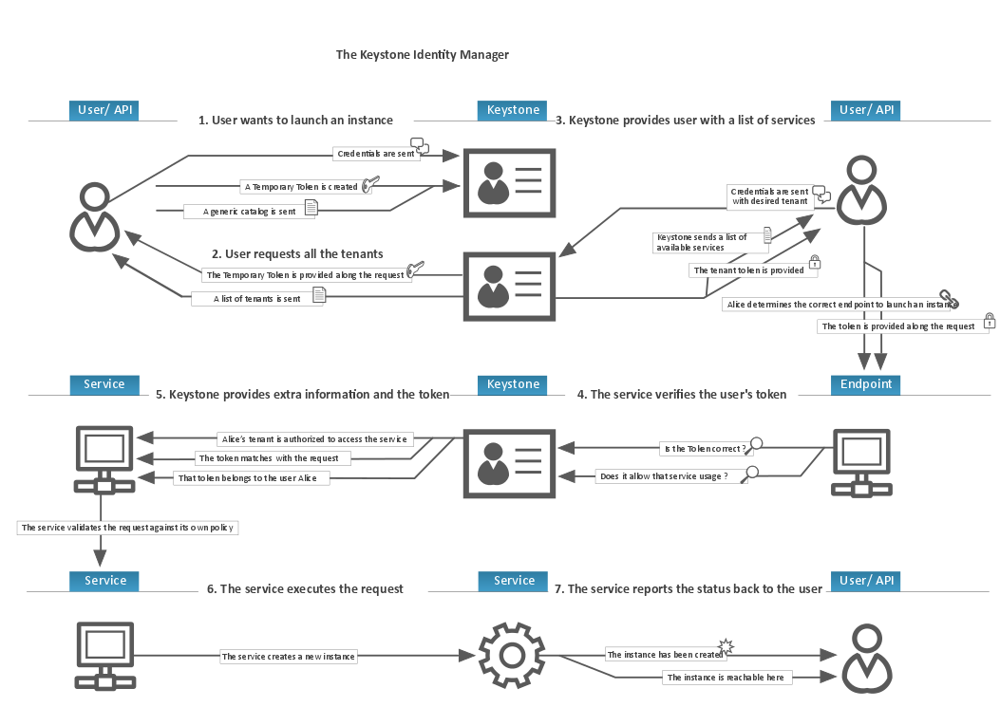

# Keystone 身份驗證套件
Keystone套件作為OpenStack中的```身份驗證服務(Identity Service)```，Keystone執行了以下兩個功能：
* **認證**與**授權**。
* 提供可用服務的 API 服務端點目錄資訊。

當安裝OpenStack ```Identity Service```套件後，必須將OpenStack的每個服務註冊到Keystone。這樣身份驗證服務才可以認證已經安裝的OpenStack服務套件，並且得知服務在網絡上的位置。```Identity Service``` 提供了 Role-based 的管理概念，並提供傳統的 ```UserName/Password```  及 ``` Token```  的認證方式

想要了解OpenStack的身份驗證套件以前，須先理解以下概念：
### User
使用OpenStack雲端服務的人、系統、服務，在Keystone會以一個數字表示。身份驗證服務會驗證那些產生呼叫的使用者傳來的請求，使用者登入後會被賦予```token```來存取資源，使用者可以直接被分配到特定的 ```Tenant``` 與```Behave```，如果這些是被包含在```Tenant```中的。

### Credentials
使用者身份的確認資料，諸如：使用者名稱、密碼、API金鑰，或者是一個有身份的服務提供授權```token```。

### Authentication
確認使用者身份的流程，OpenStack身份驗證服務會確認傳送過來的請求，即驗證由使用者提供的憑證。

這些憑證通常是使用者名稱、密碼、API金鑰等。當使用者憑證被驗證過後，OpenStack身份驗證服務會給該使用者一個```token```，透過該```token```即可請求OpenStack其他服務。

### Token
一個以字母與數字混合的字串，用來讓使用者存取OpenStack的API與資源，```token```可以隨時清除，且本身就有一定時間限制。

在近幾版本中，OpenStack身份驗證服務支援了基於```token```的驗證，這也表示未來會支持更多協定，主要目的是集成服務，且不希望成為一個完整的身份驗證儲存與管理解決方案。

> Kilo版本中的[Keystone新增功能](https://wiki.openstack.org/wiki/ReleaseNotes/Kilo#OpenStack_Identity_.28Keystone.29)。

### Tenant
用來分組或隔離資訊的容器，```tenant```會分組或者隔離身份對象。根據不同的服務操作者，```tenant```可以映射到一個客戶(customer)、帳號(account)、組織(organization)或者專案(Project)。

### Service
一個OpenStack的服務，如運算（nova），物件儲存（swift），或映像檔服務（glance）。它提供了一個或多個```Endpoint```，使用者可以訪問的資源和執行操作。

### Endpoint
當一個使用者存取服務時，所有可存取的網路網址，通常是一個URL網址。如果使用者是為板模的擴展而使用，一個```Endpoint```是可以被建立的，用來表示板模是所有可用的```跨Region```的可消費服務。

### Role
一個定義使用者權限和特權，可賦予其執行某些特定的操作。管理者可以根據不同的 role 給定不同的權限，再將 role 指定給 user，每個 user 可以同時被指定為多個 role 藉以授予系統存取權限

在身份驗證服務中，一個```token```會帶有使用者訊息，其包含了角色列表。服務在被呼叫時，會看使用者是什麼角色，而這個角色賦予的權限能夠操作哪些資源。
> Keystone 中已經有一個預設的 Role，名稱為 _member_

### Keystone Client
OpenStack 身份驗證服務API提供了一套指令介面。例如，使用者可以執行```keystone service-create```與```keystone endpoint-create```指令，在OpenStack中註冊服務。

下面示意圖展示了OpenStack身份驗證的流程：


