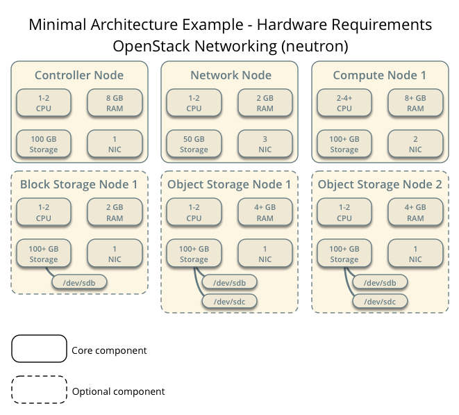

# OpenStack Ubuntu Manual 安裝
當您已完成單節點或是 DevStack 後，想當然會進一步嘗試架設多台的 OpenStack 叢集，這邊安裝提供了基於 OpenStack Neutron 的網路虛擬化部署模式，該架構需利用到三個節點進行最小架構安裝，當然這邊可以依需求增加節點來安裝諸如 Cinder 區塊儲存、Swift 物件儲存、Manila 共享式檔案系統等其他服務。以下為使用到節點角色介紹：
* **Controller Node**：OpenStack 叢集中的主要控制者，會透過 Message Queue 系統來與其他節點進行溝通，該節點也會安裝 MySQL 來儲存套件資訊與 NTP 來提供網路時間同步。在 OpenStack 套件部分會包含 Glance、Keystone、各套件的排程器與 API Server等。
> Controller

* **Network Node**：該節點主要是 OpenStack 中的網路虛擬化提供者，包含 L2、L3 與 DHCP agent 等。該節點有可以提供一些 Layer 7 的網路服務，諸如：LBaaS、FWaaS 等。
* **Compute node**：該節點主要是 OpenStack 中運算虛擬化技術 Hypervisor 的提供者，可以提供如：KVM、QEMU、Xen 等虛擬化技術。該節點也會安裝網路的 Agent 來存取 Network 節點提供的虛擬化網路給虛擬機實例使用。

以下節點屬於非核心套件的服務，可以依需求加入：
* **Block Storage Node**：該節點主要提供區塊儲存服務給虛擬機使用，讓區塊裝置可以被持久性的保存與遷移。
* **Object Storage Node**：該節點主要提供物件儲存，並且可基於 Amazon S3 RESTful API 來提供物件儲存服務。

## 最小架構環境
下圖包含OpenStack 網路(neutron) 的最小架構範例的硬體需求：

下圖包含OpenStack 網路(neutron) 的網路層的最小架構範例圖：

下圖包含OpenStack 網路(neutron) 服務層的最小架構範例：

