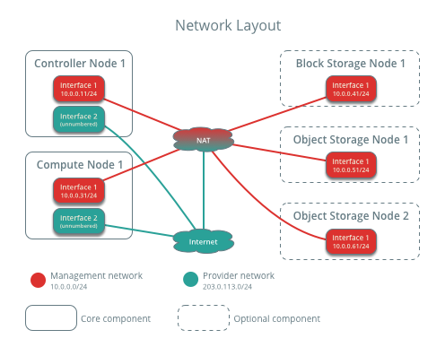

# 基本主機環境設定
本章將介紹部署一個 OpenStack 需要的基本環境建置，基本環境的建置可以確保後續部署的流暢與容易排除錯誤。在大多的 OpenStack 環境中會包含```身份認證```、```映像檔服務```、```運算服務```、```網路服務```等等，最後提供一個集中的管理介面網頁，然而尤其在網路的架構需要一開始就規劃，以下兩個方式分別需要設定不同的主機數目與硬體配置設定：
* [Neutron network 主機環境設定](neutron-network-env.md)
* [Nova network 主機環境設定](nova-network-env.md)

然而在 Neutron 網路部署中，又進一步分成以下兩種服務模式：
* **Provider Network** 的網路服務，最簡單部署是連接 Layer 2（交換器/橋接）以及網路 VLAN 切割。本質上是橋接虛擬網路的物理網路與依賴於實體網路設備（路由器）服務。
* **Self-Service** 的網路服務，可以讓部署多了 Layer 3（路由）服務的選擇，使用覆蓋網路分割租戶網路（Tanent Network），如 VXLAN、GRE。本質上它路由是使用 NAT 來讓虛擬網路對應到實體網路。此外夠能夠根據需求建置 Layer 7 的網路服務，如 LBaaS 與 FWaaS。



# 基本套件安裝與設定
OpenStack 的節點需要進行一些基本套件的安裝與設定，其中包含新增 OpenStack 所有套件的資源庫（Repository）等。其中這些環境套件的部署包含 NTP、SQL Database、Message Queue等，如以下列表：
* [基本套件安裝與設定](basic-package-env.md)
* [MySQL High Availability 安裝（Galera）](mariadb_galera _install.md)
* [RabbitMQ Cluster 安裝](rabbitmq_cluster_insall.md)
