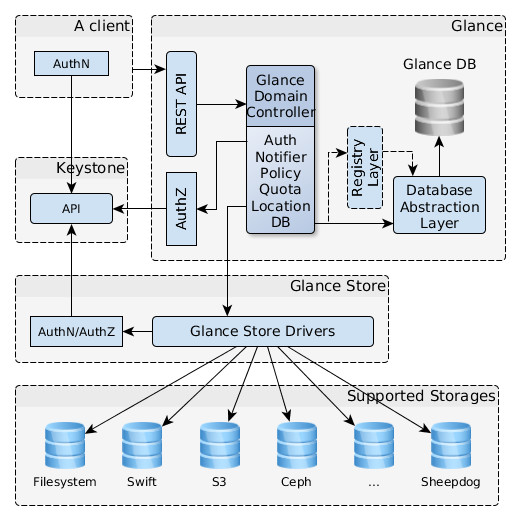

# Glance 映像檔套件
Glance作為OpenStack的```Image service```，提供使用者可以去尋找、註冊、取得虛擬機的Image。並提供了一個REST API，使你能夠查詢虛擬機Image的metadata與取得實際的Image。你可以透過```Image service```儲存在不同的地點所提供虛擬機Image，從簡單的檔案系統到像是物件儲存系統的OpenStack ```Object Storage（Swift）```。除了可以讓使用者新增 image 之外，也可以從正在運作的 server 上取得 snapshop 來作為 image 的備份或者是其他虛擬磁碟的 image。

OpenStack的```映像檔服務(Image service)```包含了以下幾個元件：
* **glance-api**：接受來至其他服務的API呼叫，諸如Image尋找、取得、儲存。
* **glance-registry**：儲存、處理以及取得Image的metadata，metadata（包含諸如檔案大小、類型等資訊）。
* **Database**：存放Images的metadata資訊，使用者可以根據個人喜好選擇資料庫，大多數選擇MySQL或SQLite。
* **Image的Storage Repository**：支援多種類型的Repository，可以從```一般檔案系統```、```Object Storage（Swift）```、```RADOS Block device```、```HTTP```、```Amazon S3```等。但要注意，其中一些Repository只支援讀取。


從Openstack架構圖，可以看到```Glance```的定位：

1. 可以將 image 存於 Swift 中。
2. 提供 image 給 Nova 作為執行 VM 之用。
3. 使用者可以透過 Horizon 呼叫 Glance API 來管理 image。
4. 在使用 Glance API 之前，都需要通過 Keystone 的認證。


Glance架構圖中是由幾個元件組成：

* **A client** - any application that uses Glance server.
* **REST API** - exposes Glance functionality via REST.
* **Database Abstraction Layer (DAL)** - an application programming interface which unifies the communication between Glance and databases.
* **Glance Domain Controller** - middleware that implements the main Glance functionalities: authorization, notifications, policies, database connections.
* **Glance Store** - organizes interactions between Glance and various data stores.
* **Registry Layer** - optional layer organizing secure communication between the domain and the DAL by using a separate service.

