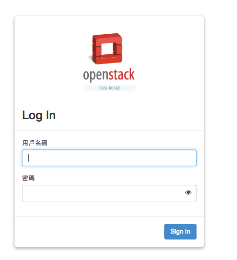

# Horizon 安裝與設定
本章節會說明與操作如何安裝```Dashboard```服務到OpenStack Controller節點上，並設置相關參數與設定。若對於Horizon不瞭解的人，可以參考[Horizon 儀表板套件章節](horizon.html)

#### 安裝套件
假設我們的基本OpenStack環境都確認完成後，回到```Controller```節點上透過```apt-get```安裝```dashboard```套件：
```sh
sudo apt-get install openstack-dashboard
```
> Ubuntu 安裝openstack-dashboard時，會有```ubuntu-theme```套件，若發生問題或者不需要，可以直接刪除該套件。
```sh
sudo apt-get remove --purge openstack-dashboard-ubuntu-theme
```

#### 設定儀表板
編輯```/etc/openstack-dashboard/local_settings.py ```修改以下：
```py
OPENSTACK_HOST = "controller"
ALLOWED_HOSTS = '*'

CACHES = {
   'default': {
       'BACKEND': 'django.core.cache.backends.memcached.MemcachedCache',
       'LOCATION': '127.0.0.1:11211',
   }
}

OPENSTACK_KEYSTONE_DEFAULT_ROLE = "user"

TIME_ZONE = "TIME_ZONE"
```
> Replace TIME_ZONE with an appropriate time zone identifier. For more information, see the [list of time zones](https://en.wikipedia.org/wiki/List_of_tz_database_time_zones).

重新讀取服務：
```sh
sudo service apache2 reload
```

# 驗證操作
這個部分將描述如何進行儀表板的驗證操作，依照以下兩個簡單步驟：
1. 開啟web瀏覽器進入儀表板: http://controller/horizon。
2. 使用admin或demo的使用者登入。


