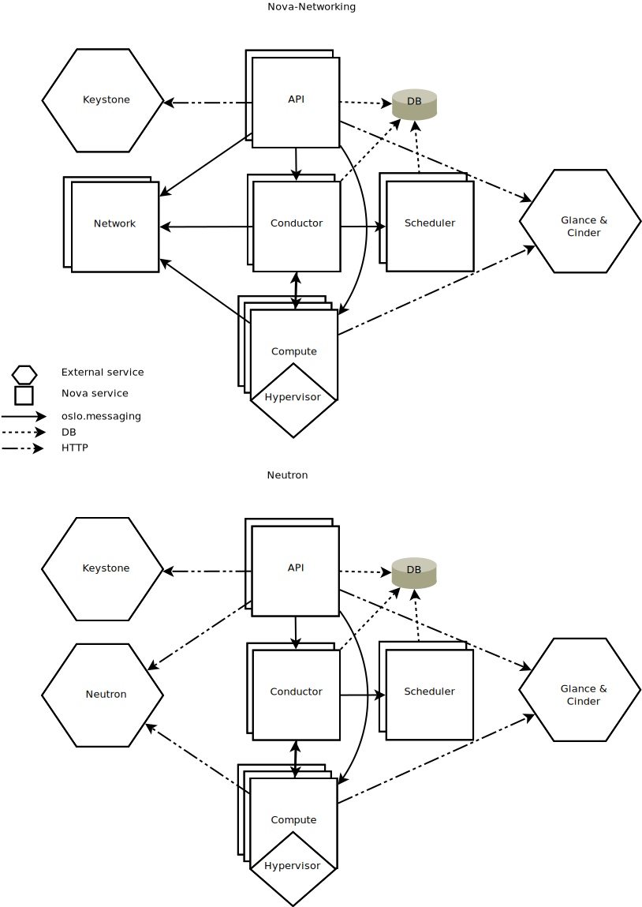

# Nova 運算套件
OpenStack的Nova套件提供了```Compute Service``` ，在整個 ```IaaS``` 的架構中是屬於最主要的部份，同時會向 ```Identity Service``` 進行認證授權、向 ````Image Service```` 要求 image、將資料提供給 ````Dashboard```` …. 等等。

OpenStack 運算互動於OpenStack登入驗證、OpenStack Image service的磁碟與伺服器映像檔、OpenStack儀表板的使用者與管理介面。映像檔的存取是受限制於```projects```以及```users```; ```quotas```受限於每個```project(好比Instance的數量)```。OpenStack 運算能夠水平擴展於基底硬體以及下載映像檔來執行instances。



OpenStack運算服務由下列套件所組成：

#### API
* **nova-api service**：接收與回應來自```End user的運算API請求。此服務支援OpenStack```Compute Service```API、Amazon的EC2 API以及管理API，用於給予使用者做一些管理的操作。它會強制實施一些規則，發起數個的排程活動，例如執行一個實例。
* **nova-api-metadata service**：用來回應接收來自Instance metadata的請求。當你在多台compute node，並進行```nova-network```安裝時，nova-api-metadata服務會正常使用。在細節部分，可以看[Metadata service](http://docs.openstack.org/admin-guide-cloud/content/section_metadata-service.html)的指南。在```Debian```的系統中，它包含在nova-api套件中，可透過debconf來選擇是否安裝。

#### Compute core
這元件包含了幾個重要的 daemon，來共同組成 Compute Core 以提供服務：
* **nova-compute service**：一個持續執行的```daemon```，透過Hypervior的API來建立與刪除虛擬機Instance。例如以下：

    * Xen API for ```XenServer/XCP```。
    * libvirt for ```KVM``` or ```QEMU```。
    * VMware API for ```VMware```。

 過程處理是相當複雜的。基本上，```daemon```同意來自```Message Queue```的動作請求，並轉換為一系列的系統指令，如啟動一個KVM Instance，然後到資料庫中更新它的狀態。
* **nova-scheduler service**：取得 VM instance 的需求後，根據制定的規則以及資源目前情況，決定要讓 VM 在哪一台實體主機啟動。
* **nova-conductor module**：Mediates互動於nova-compute以及資料庫之間。它消除了直接存取由nova-compute服務所取得的雲端資料庫。nova-conductor 模組是水平擴展的。但是，不要在運行nova-compute服務的節點上部署。細節部分可以觀看[A new Nova service: nova-conductor](http://blog.russellbryant.net/2012/11/19/a-new-nova-service-nova-conductor/)。
* **nova-cert module**：一個伺服器的```daemon```，為X509 憑證服務的nova-cert服務，用於euca-bundle-image生成憑證使用，僅限於EC2 API。

#### Networking for VMs
這個部分的功能已經被移進獨立的 Network Service (Neutron) 了，但還是可以簡單說明一下：
* **nova-network worker daemon**：與nova-compute服務類似，從```Message Queue```接收網絡任務，然後操作網絡執行任務，諸如設置```網路橋接```或更改```IPtables```規則。

#### Console interface
* **nova-consoleauth daemon**：授權使用者console proxy提供```token```。如```nova-novncproxy```與```nova-xvpvncproxy```。此服務必須運行控制台的proxy來工作。您可以在叢集設定中，執行任何類型，針對單個nova-consoleauth服務proxy。細節部分可以參考[About nova-consoleauth](http://docs.openstack.org/admin-guide-cloud/content/about-nova-consoleauth.html)。
* **nova-novncproxy daemon**：作為透過 VNC 連線時存取 instance VM 的 proxy 之用，支援 browser-based novnc client。
* **nova-spicehtml5proxy daemon**：提供一個代理，用於存取正在運作的Instance，透過SPICE 協定，支援基於瀏覽器的HTML5 客戶端。
* **nova-xvpvncproxy daemon**：作為透過 VNC 連線時存取 instance VM 的 proxy 之用，支援 Java client 的連線。
* **nova-cert daemon**：X509 憑證。

#### Image management (EC2 scenario)
* **nova-objectstore daemon**：一個S3介面用來註冊映像檔與OpenStack Image服務。主要用於需要支援euca2ools的安裝。euca2ools工具會在S3語言中溝通nova-object-store ，以及nova-object-store會轉換S3的請求為Image service請求。
* **euca2ools client**：一組命令列解譯器的指令，用來管理雲端資源。雖然它不是OpenStack的模組，但可以配置API支援EC2的介面。


#### Command-line clients and other interfaces
* **nova client**：給使用者作為tenant管理員或end user提交指令用。

#### Other components
* **Message Queue**：一個通過訊息中心之間的```daemons```。通常使用RabbitMQ，但可以用一個AMQP訊息佇列協定來實現。諸如[Apache Qpid](http://qpid.apache.org/) or [Zero MQ](http://zeromq.org/)。
* **SQL Database**：儲存建構時與執行時的狀態，即為雲端基礎設施，包含以下：
    * 可用的Instance類型
    * 使用中的Instance
    * 可用的網路
    * Projects

 理論上，OpenStack運算服務可以支援任何與SQL-Alchemy所支援的後端資料庫，通常使用SQLite3來做測試可開發工作，MySQL和PostgreSQL 作為生產環境。

#### Nova Compute 支援的格式
OpenStack有支援多家大廠的映像檔(Image)包括Amazon、Windows Hyper-V、VMware等等，下面列出支援格式
* AKI - Amazon Kernel Image
* AMI - Amazon Machine Iamge
* ARI - Amazon Ramdisk Iamge
* ISO - Optical Disk Image
* QCOW2 - QEMU Emulator
* Raw
* VDI
* VHD - Windows Hyper-V
* VMDK - VMWare