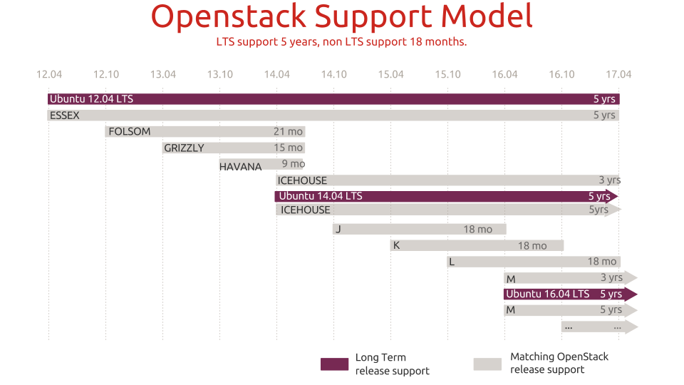

# Neutron 多節點安裝
### 硬體規格分配
* **Controller Node**: 四核處理器, 8 GB 記憶體, 20 GB 儲存空間
* **Network Node**: 雙核處理器, 4 GB 記憶體, 20 GB 儲存空間
* **Compute Node**: 四核處理器, 8 GB 記憶體, 32 GB 儲存空間

> 注意以上節點的 Linux OS 請採用```64位元```的版本，因為若是在 Compute 節點安裝```32位元```，在執行映像檔時，會出錯。

> 且每個節點儲存空間必須大於規格，若需要安裝其他服務，並分離儲存磁區時，請採用```Logical Volume Manager (LVM)```。

> 如果您選擇安裝在虛擬機上，請確認虛擬機是否允許混雜模式，並關閉MAC地址，在外部網絡上的過濾。

### 網路分配與說明
這次安裝會採用```Neutron```網路套件來網路的處理，本次架構需要一台Controller、Network、Compute節點(若加其他則不同)，在 Network節點上需要提供一張作為```管理網路```、一張 ```Instance溝通```、一張```外部網路```的網路介面(NIC)，詳細分配如下：

* **管理網路**：10.0.0.0/24，有Gateway 10.0.0.1。

 > 需要提供一個Gateway來為所有節點提供內部管理存取，例如套件的安裝、安全更新、DNS 以及 NTP等。

* **Instance通道網路**：10.0.1.0/24，無Gateway。

 > 不需要設定Gateway，因為這是Network節點與Compute的Instance做GRE使用。

* **外部網路**：192.168.20.0/24，有Gateway 192.168.20.1。

 > 提供一個外部網路，讓Network節點可以透過GRE使Compute節點上的Instance存取網際網路，```注意！這邊會根據環境的不同而改變```。


 以下指令可以幫助你設定```sudo```與```eth```：
```sh
# 設定不需要密碼
echo "openstack ALL = (root) NOPASSWD:ALL" | sudo tee /etc/sudoers.d/openstack && sudo chmod 440 /etc/sudoers.d/openstack

# 列出eth device
dmesg | grep -i network

# 修改/etc/network/interfaces
auto eth0
iface eth0 inet static
        address 10.0.0.11
        netmask 255.255.255.0
        network 10.0.0.0
        broadcast 10.0.0.255
        gateway 10.0.0.1
        dns-nameservers 8.8.8.8
```

### Controller node 設定
將第一張網卡介面設定為```管理網路```：
* IP address: 10.0.0.11
* Network mask: 255.255.255.0 (or /24)
* Default gateway: 10.0.0.1

完成後，重新開機來改變設定。

再來修改```/etc/hostname```來改變主機名稱為```controller```，並設定主機的```/etc/hosts```：
```sh
# controller
10.0.0.11   controller
# network
10.0.0.21   network
# compute1
10.0.0.31   compute1
```
> 注意！若有```127.0.0.1 localhost```存在的話，請將之註解掉，避免解析問題。

### Network node 設定
將第一張網卡介面設定為```管理網路```：
* IP address: 10.0.0.21
* Network mask: 255.255.255.0 (or /24)
* Default gateway: 10.0.0.1

然後將第二張設定為```Instance溝通介面```：
* IP address: 10.0.1.21
* Network mask: 255.255.255.0 (or /24)

再來設定```外部網路介面```，外部網路比較特殊，但我們可以將名稱命名為```eth2```或```ens256```等名稱，可以修改檔案```/etc/network/interfaces```：
```sh
# The external network interface
auto <INTERFACE_NAME>
iface <IINTERFACE_NAME> inet manual
        up ip link set dev $IFACE up
        down ip link set dev $IFACE down
```
完成後，重新開機來改變設定。

再來修改```/etc/hostname```來改變主機名稱為```network```，並設定主機的```/etc/hosts```：
```sh
# network
10.0.0.21       network
# controller
10.0.0.11       controller
# compute1
10.0.0.31       compute1
```
> 注意！若有```127.0.0.1 localhost```存在的話，請將之註解掉，避免解析問題。

### Compute node設定
將第一張網卡介面設定為```管理網路```：
* IP address: 10.0.0.31
* Network mask: 255.255.255.0 (or /24)
* Default gateway: 10.0.0.1

> 若有多個Compute node，則以10.0.0.32類推。

然後將第二張設定為```Instance溝通介面```：
* IP address: 10.0.1.31
* Network mask: 255.255.255.0 (or /24)

> 若有多個Compute node，則以10.0.1.32類推。

完成後，重新開機來改變設定。

再來修改```/etc/hostname```來改變主機名稱為```compute1```，並設定主機的```/etc/hosts```：
```sh
# compute1
10.0.0.31       compute1
# controller
10.0.0.11       controller
# network
10.0.0.21       network
```

> * 注意！若有```127.0.0.1 localhost```存在的話，請將之註解掉，避免解析問題。


完成上述設定後，可利用```ping```指令於每個節點做網路測試。

# Nova-network 基本環境
### 硬體規格分配
* **Controller Node**: 四核處理器, 8 GB 記憶體, 20 GB 儲存空間
* **Compute Node**: 四核處理器, 8 GB 記憶體, 32 GB 儲存空間

> 注意以上節點的 Linux OS 請採用```64位元```的版本，因為若是在 Compute 節點安裝```32位元```，在執行映像檔時，會出錯。

> 且每個節點儲存空間必須大於規格，若需要安裝其他服務，並分離儲存磁區時，請採用```Logical Volume Manager (LVM)```。

### 網路分配與說明
這次安裝會採用```nova-network```網路套件來網路的處理，本次架構需要一台Controller、Compute節點(若加其他則不同)，在 Controller上需要有一個管理的網路介面，然而Compute需要有一個管理與外部的網路介面，詳細分配如下：

* **管理網路**：10.0.0.0/24，有Gateway 10.0.0.1。

 > 需要提供一個Gateway來為所有節點提供內部管理存取，例如套件的安裝、安全更新、DNS 以及 NTP等。

* **外部網路**：192.168.20.0/24，有Gateway 192.168.20.1。

 > 提供一個外部網路，使Compute節點上的Instance存取網際網路，```注意！這邊會根據環境的不同而改變```。

### Controller node 設定
將第一張網卡介面設定為```管理網路```：
* IP address: 10.0.0.11
* Network mask: 255.255.255.0 (or /24)
* Default gateway: 10.0.0.1

完成後，重新開機來改變設定。

再來修改```/etc/hostname```來改變主機名稱為```controller```，並設定主機的```/etc/hosts```：
```sh
# controller
10.0.0.11   controller
# compute1
10.0.0.31   compute1
```
> 注意！若有```127.0.0.1 localhost```存在的話，請將之註解掉，避免解析問題。

### Compute node設定
將第一張網卡介面設定為```管理網路```：
* IP address: 10.0.0.31
* Network mask: 255.255.255.0 (or /24)
* Default gateway: 10.0.0.1

> 若有多個Compute node，則以10.0.0.32類推。

然後將第二張設定為```外部網路介面```，編輯```/etc/network/interfaces```更改為以下：
```
# The external network interface
auto INTERFACE_NAME
iface INTERFACE_NAME inet manual
        up ip link set dev $IFACE up
        down ip link set dev $IFACE down
```

> 若有多個Compute node，則以10.0.1.32類推。

完成後，重新開機來改變設定。

再來修改```/etc/hostname```來改變主機名稱為```compute1```，並設定主機的```/etc/hosts```：
```sh
# compute1
10.0.0.31       compute1
# controller
10.0.0.11       controller
```

> * 注意！若有```127.0.0.1 localhost```存在的話，請將之註解掉，避免解析問題。


完成上述設定後，可利用```ping```指令於每個節點做網路測試。

# Network Time Protocol (NTP)
由於要讓各節點的時間能夠同步，我們需要安裝```ntp```套件來提供服務，這邊推薦將ntp Server安裝於Controller上，再讓其他節點進行關聯即可。
### Controller node 設定
在Controller節點上，我們可以透過```apt-get```來安裝相關套件：
```sh
sudo apt-get install -y ntp
```
完成安裝後，預設NTP會透過公有的伺服器來同步時間，但也可以修改```/etc/ntp.conf```來選擇伺服器：
```sh
server NTP_SERVER iburst
restrict -4 default kod notrap nomodify
restrict -6 default kod notrap nomodify
```
將 ```NTP_SERVER``` 替換為主機名稱或更準確的(lower stratum) NTP 伺服器IP地址。這個設定支援多個 server 關鍵字。
> * 對於restrict 參數，基本上需要刪除nopeer 和noquery 選項。
* 如果系統有```/var/lib/ntp/ntp.conf.dhcp```存在，請將它刪除。

台灣NTP網址：
```
restrict 10.0.0.0 mask 255.255.255.0 nomodify notrap

server 1.tw.pool.ntp.org iburst
server 3.asia.pool.ntp.org iburst
server 2.asia.pool.ntp.org iburst
```

完成後，重啟服務：
```sh
sudo service ntp restart
```

### Other node 設定
透過```apt-get```安裝ntp:
```sh
sudo apt-get install -y ntp
```
完成安裝後，修改```/etc/ntp.conf```檔案，註解掉所有```server```的參數，並將其設定為controller host：
```sh
server controller iburst
```
> 如果系統有```/var/lib/ntp/ntp.conf.dhcp```存在，請將它刪除。

完成後，重啟服務：
```sh
sudo service ntp restart
```

### 驗證設定
當完成上述設定後，建議在進一步的安裝之前驗證NTP 是否已同步。有些節點，特別是哪些引用了Controller節點，需要花費一些時間去同步。

可以在Controller節點，下該指令：
```sh
ntpq -c peers
# 會看到類似以下資訊
     remote           refid      st t when poll reach   delay   offset  jitter
==============================================================================
*ntp-server1     192.0.2.11       2 u  169 1024  377    1.901   -0.611   5.483
+ntp-server2     192.0.2.12       2 u  887 1024  377    0.922   -0.246   2.864
```
也可以透過以下指令，進一步對Controller做驗證：
```sh
ntpq -c assoc
# 會看到類似以下資訊
ind assid status  conf reach auth condition  last_event cnt
===========================================================
  1 20487  961a   yes   yes  none  sys.peer    sys_peer  1
  2 20488  941a   yes   yes  none candidate    sys_peer  1
```
當都沒問題後，可以在其他節點下達該指令：
```sh
ntpq -c peers
# 會看到類似以下資訊
     remote           refid      st t when poll reach   delay   offset  jitter
==============================================================================
*controller      192.0.2.21       3 u   47   64   37    0.308   -0.251   0.079
```
一樣進一步對其他節點做驗證，可下達該指令：
```sh
ntpq -c assoc
# 會看到類似以下資訊
ind assid status  conf reach auth condition  last_event cnt
===========================================================
  1 21181  963a   yes   yes  none  sys.peer    sys_peer  3
```

# 安裝OpenStack套件
接下來我們需在每個節點安裝Openstack相關套件，但由於Ubuntu的版本差異，會影響OpenStack支援的版本，在安裝時要特別注意是否支援，才會有對應的repository可以使用，支援狀況如下圖：


若是Ubuntu ```15.04 以下```的版本，需加入Repository來獲取套件：
```sh
sudo apt-get install ubuntu-cloud-keyring
echo "deb http://ubuntu-cloud.archive.canonical.com/ubuntu trusty-updates/kilo main" |  sudo tee /etc/apt/sources.list.d/cloudarchive-kilo.list
```
更新Repository與更新套件：
```sh
sudo apt-get update && sudo apt-get -y  dist-upgrade
```
> 如果Upgrade包含了新的核心套件的話，請重新開機。

# SQL database 安裝
大部份的OpenStack套件服務都是只用SQL 資料庫來儲存訊息，該資料庫運作於Controller上。以下我們使用了MariaDB或MySQL來分佈。OpenStack也支援了其他資料庫，諸如：PostgreSQL。

透過```apt-get```來安裝套件：
```sh
sudo apt-get install -y mariadb-server python-mysqldb
```
> 記住Python MySQL 和 MariaDB 是相容的。

安裝完成後，需要設定```root```密碼，這邊設定為```r00tme```，再來需要建立與修改```/etc/mysql/conf.d/mysqld_openstack.cnf```來設定資料庫：
* 在```[mysqld]```將```bind-address```改為Controller host
```sh
[mysqld]
bind-address = 10.0.0.11
```

* 在```[mysqld]```通過修改下列參數項目，提供一些有用的設定，並使用UTF-8編碼
```sh
[mysqld]
...
default-storage-engine = innodb
innodb_file_per_table
collation-server = utf8_general_ci
init-connect = 'SET NAMES utf8'
character-set-server = utf8
```

完成後，重啟mysql服務：
```sh
sudo service mysql restart
```
並對資料庫進行安全設定：
```sh
sudo mysql_secure_installation
```
對於每個項目```yes```，並設置對應資訊。

# Message queue 安裝
OpenStack使用Message Queue來對整個叢集提供協調與狀態訊息服務。Openstack支援的Message Queue包含以下[RabbitMQ](http://www.rabbitmq.com/)、[Qpid](http://qpid.apache.org/)、[ZeroMQ](http://zeromq.org/)。但是大多數的發行版本支援特殊的Message Queue服務，這邊我們使用了```RabbitMQ```來實現，首先透過```apt-get```安裝套件：
```sh
sudo apt-get install -y rabbitmq-server
```
安裝完成後，新增一個user:
```sh
sudo rabbitmqctl add_user openstack RABBIT_PASS
# 成功會看到以下資訊
Creating user "openstack" ...
...done.
```
> 可以更改RABBIT_PASS，來改變密碼。

為剛建立的user開啟權限：
```sh
sudo rabbitmqctl set_permissions openstack ".*" ".*" ".*"
# 成功會看到以下資訊
Setting permissions for user "openstack" in vhost "/" ...
...done.
```

# 提醒
接下來會依序針對OpenStack的基礎套件安裝與設定，若發現有以下格式設定，裡面的```...```代表預設設定參數，若沒提示```要註解掉```，請不要更改：
```
[DEFAULT]
...
admin_token = 74e00617afa2008fcf25
```
